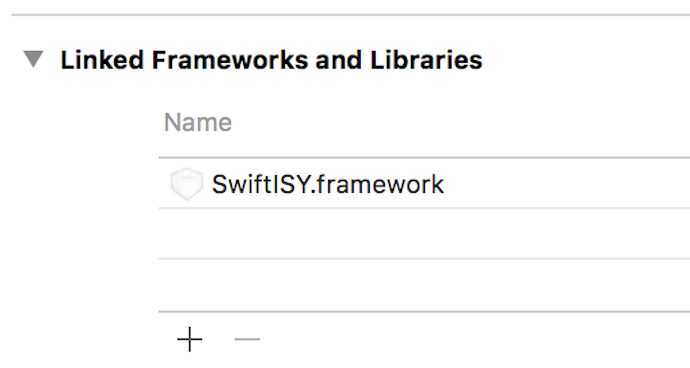

# Digest

[]()
[]() []()
[](https://github.com/Carthage/Carthage)
[]()

__Digest__ provides a Swift implemantation for SHA 256 hash.  It includes `Sha256_Nist` which is a reference
implentation based on the FIPS 180-4 Secure Hash Standard (SHS) publication provided by the National Institute of
Standards and Technology (NIST).

In addition, `Sha256` is a similar implementation that utilizes an `InputStream` to decrease memory usage while
processing a file.  And pointers.  However the use of pointers to bytes may be less beneficial an arrays.

Neither Sha256_Nist nor Sha256 should be used in a production enviroment.  This implentation is simply a case
study for Swift.

Alternative implementations such as  `CommonCrypto` that leverages hardware acceleration should be used.
Hardware acceleration can result in more than 30x performance improvement.

## Usage

```swift
import Digest

// Get SHA256 Digest for an empty string.
let digest = Sha256(string: "")!.digest!.hex

```

## Installation

1. Build Digest framework.
3. In *Build Phases*, add `Digest.framework` library to your project.
<br />
5. `import Digest` in your Swift file.
6. Use in your code.

### Build via Carthage
Digest is [Carthage](https://github.com/Carthage/Carthage) compatible. You can easily build
Digest by adding the following line to your Cartfile.

```ruby
github "wyzzarz/Digest"
```

To install the framework, run `carthage update --platform iOS --use-submodules`.  The script
`carthage-update.sh` includes this command.

## Author

Copyright 2018 Warner Zee.

## License

Digest is available under the Apache License, Version 2.0. See the [LICENSE](LICENSE) file for more info.
